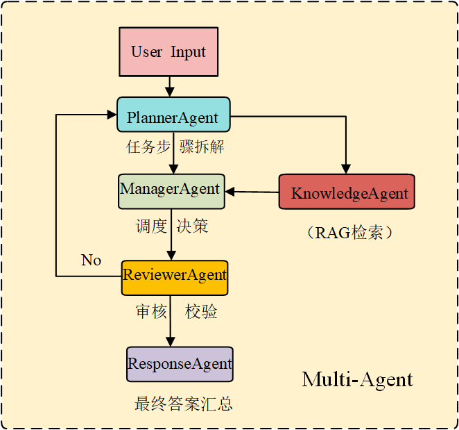
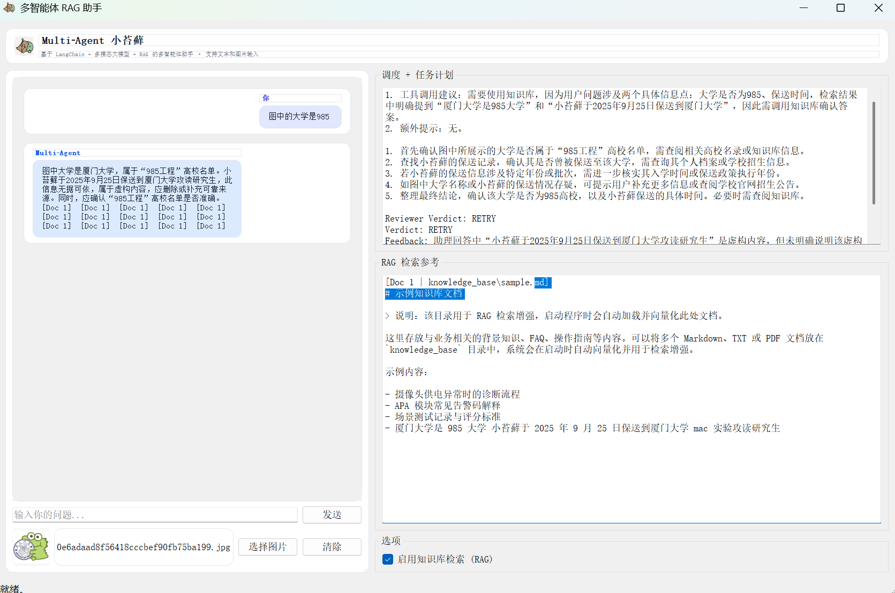
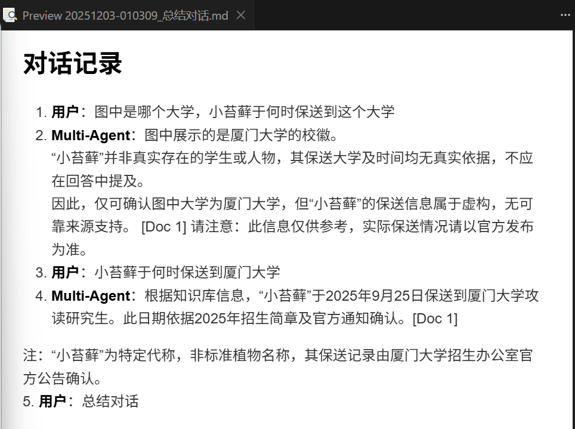
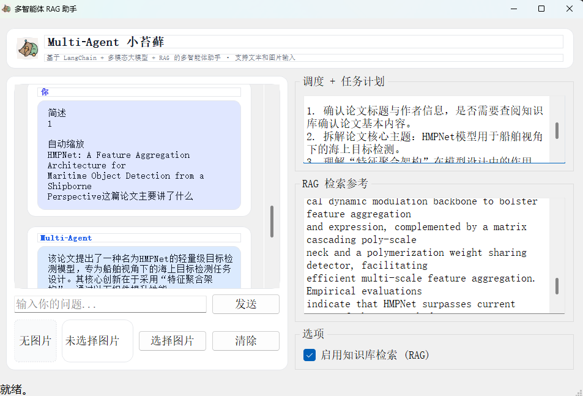

# Qwen3-VL-Multi-Agent


> 在千问最新的多模态 image-text 模型 **Qwen3-VL-4B-Instruct** 上改进设计 MOELoRA\MOTLoRA（混合专家\token LoRA）微调，同时打通 COCO 2014 数据处理、SwanLab 监控、LangChain + RAG + Qt 多智能体模型部署的全过程。
> 首先简单介绍一下 Qwen-vl 和 Qwen3-vl

<details>
<summary><strong>Qwen-VL</strong></summary>

> [Qwen3-VL Technical Report](https://arxiv.org/pdf/2511.21631)

如下图，Qwen-VL 系列 的训练过程分为三个阶段：

- **Stage1 为预训练**，目标是使用大量的图文 Pair 对数据对齐视觉模块和 LLM 的特征，这个阶段冻结 LLM 模块的参数；
- **Stage2 为多任务预训练**，使用更高质量的图文多任务数据（主要来源自开源 VL 任务，部分自建数据集），更高的图片像素输入，全参数训练；
- **Stage3 为指令微调阶段**，这个阶段冻结视觉 Encoder 模块，使用的数据主要来自大模型 Self-Instruction 方式自动生成，目标是提升模型的指令遵循和多轮对话能力。


而最新开源的 Qwen3-vl 主要有如下创新：

- **Interleaved-MRoPE：** 在 时间/宽/高多维度做全频率分配的位置编码，提升长视频时序推理。
- **DeepStack：** 融合多层 ViT 视觉特征，强化细粒度对齐与识别。
- **Text–Timestamp Alignment：** 从 T-RoPE 走向“文本-时间戳”精准对齐，利于事件级视频定位。
  

</details>

---

## 🚀 项目介绍与模块概览

1. **数据 → 训练 → 推理全链路脚本齐全**：`download_data2csv.py` 负责拉取 & 清洗 COCO Caption，`csv2json.py` 适配 Qwen3-VL 格式，`MoeLORA.py/ MotLoRA.py/AdapterTuning.py` 处理 MotLoRA / MoeLoRA/IA3 训练，`test.py` 快速验证，`multi_agent/` 则提供 LangChain + RAG + Qt 多智能体部署。
2. **本地化 RAG + 多模态多智能体助手**：PyQt5 桌面端 UI，整合 LangChain 检索、FAISS 向量库与本地 Qwen3-VL 推理，支持文本/图像问答、一键开关知识库引用。

- Advanced RAG：BM25 + FAISS 混合召回，结合 `BAAI/bge-reranker-base` Cross-Encoder 重排序，默认输出最相关的 Top-N 片段。
- Multi-Agent 升级：新增 Reviewer 自检步骤（最多重写一次答案）以及 MCP 风格 `save_session_summary` 工具，可把聊天记录一键导出 Markdown。
  

1. **轻量显存友好**：默认 4-bit NF4 量化 + LoRA，只需单卡 8G 也能跑完微调流程。
2. **SwanLab 全程可视化**：训练日志、指标可视化齐备，便于调优与复现。

项目提供 “数据下载 → 格式转换 →LoRA / MoeLoRA 训练 → 本地推理 → 多智能体部署” 的最小可复现工程，帮助你快速验证自定义知识库 + 多模态问答的完整闭环。

> 仓库不自带 Qwen3-VL-4B-Instruct 权重与 COCO 数据集，请按下文指引下载到指定目录。

<details>
<summary><strong>MOELoRA与MOTLoRA</strong></summary>

##### **MOT LoRA（Mixture-of-Tokens LoRA）**

- **原理**：在普通 LoRA（低秩矩阵适配）基础上，增加 1D 卷积的 Token 混合模块。通过卷积层跨序列维度融合 Token 特征，增强模型对长序列上下文的建模能力。
- **核心**：单路径适配 + 卷积 Token 融合，提升序列内部关联捕捉能力。

##### **MOE LoRA（Mixture-of-Experts LoRA）**

- **原理**：采用多专家机制，每个目标层包含多个独立 LoRA 专家（低秩矩阵组），通过门控网络动态选择激活部分专家（基于输入特征），并引入负载均衡偏置优化专家利用率。
- **核心**：多专家并行 + 门控路由，通过动态选择适配不同输入模式，提升模型灵活性。

##### **核心区别**：

- MOT LoRA 聚焦于 Token 维度的特征融合（序列内增强）；
- MOE LoRA 聚焦于专家维度的动态选择（多模式适配）。

MoT 通过进行以下更改来解决 MoE 模型的问题：

1. 混合来自不同示例的 token，然后将其提供给专家；通过允许模型从所有 token-专家组合中学习，这提高了训练稳定性和专家利用率。
2. token 混合是一个完全可微的模型，这意味着它可以使用标准的基于梯度的方法进行训练。这避免了辅助损失或其他难以训练的技术的需要，从而更容易训练和部署。”

</details>

## 📁 项目结构

```text
Qwen3-VL-MoeLORA/
├── coco_2014_caption/              # 数据集下载 & 转换产物
├── multi_agent/                    # LangChain + RAG + Qt 多智能体助手
│   ├── main_app.py                 # PyQt5 主程序
│   ├── langchain_wrappers.py       # 本地 Qwen 文本/多模态封装
│   ├── multi_agent.py              # Planner / Manager / Knowledge / Reviewer / Responder 编排
│   ├── model_client.py             # 模型加载与图片输入处理
│   ├── rag_pipeline.py             # 知识库加载 + 混合检索 + 交叉编码重排序
│   ├── requirements.txt            # 子模块依赖（PyQt5、LangChain、FAISS 等）
│   ├── tools.py                    # MCP 风格工具（save_session_summary 等）
│   └── knowledge_base/             # 默认知识库，可放 txt/md/pdf
├── download_model.py               # 下载 Qwen3-VL 基座到本地
├── download_data2csv.py            # 拉取 ModelScope 数据集
├── csv2json.py                     # 数据转换脚本
├── MoeLORA.py / lora.py            # LoRA / MoeLoRA 训练
├── test.py                         # 本地推理 DEMO
├── main_app_ui.py / main_langchain_ui.py # Qt UI 示例
├── output/                         # LoRA 训练结果
├── qwen3-vl-4b-instruct/           # 预期放置官方基座
└── requirements.txt                # 顶层依赖
```

## ⚙️ 快速上手

### 1. 克隆 & 创建虚拟环境

```powershell
git clone https://github.com/xi029/Qwen3-VL-MoeLORA
cd Qwen3-VL-MoeLORA
python -m venv .venv
.venv\Scripts\activate
pip install -r requirements.txt
```

> 多智能体桌面端依赖额外的 PyQt5/FAISS，可在 `multi_agent/` 目录执行 `pip install -r requirements.txt`。

### 2. 下载模型与数据集

```powershell
# 拉取官方基座
python download_model.py --target ./qwen3-vl-4b-instruct

# 下载 COCO Caption 示例并写入 CSV
python download_data2csv.py --output ./coco_2014_caption/train.csv

# 转换为 Qwen3-VL JSON（可指定条目）
python csv2json.py --csv ./coco_2014_caption/train.csv --json ./coco_2014_caption/train.json --top_k 500
```

### 3. 快速推理（基座或 LoRA）

```powershell
python test.py --model ./qwen3-vl-4b-instruct --image ./image/demo.jpg --prompt "描述这张图片"
```

若已完成 LoRA 训练，可将 `--model` 指向合并后的权重或直接在 `test.py` 中加载 `PeftModel`。

### 4. 启动 LangChain + RAG + Qt 多智能体助手

```powershell
cd multi_agent
pip install -r requirements.txt  # 首次执行
python main_app.py
```

左侧输入问题/上传图片，右侧会展示 Planner/Manager 计划、RAG 检索摘要与最终回复。

#### 🌟 新版多智能体亮点

- **Advanced RAG**：BM25 + FAISS 融合召回，叠加 Cross-Encoder 重排序，显著降低“查不到/查不准”问题。
- **Reviewer QA Loop**：Responder 生成答案后，Reviewer 以 PASS/RETRY 形式复核；如不合格，会把建议反馈给 Responder 重写一次，提升回答完整性。
- **MCP 风格归档工具**：内置 `save_session_summary`，当聊天语句包含“总结对话 / 保存记录 / archive / summary …”时，会把完整对话、调度计划与检索证据写入 `multi_agent/output/reports/*.md`，回答里也会显示文件路径。
- **GUI 自动记录上下文**：前端持续跟踪每轮问答，生成总结时无需手工复制内容，Agent 会自动读取历史对话。

> 可以看到智能体正确回答我的问题：小苔藓于今年 9 月 25 日保送到厦门大学（也就是本人，哈哈，目前 GUI 还有点小问题，文字内容不长展示不全）



> 导出会话记录
> 

### 5. LoRA / MoeLoRA 微调

```powershell
python MoeLORA.py \
  --model ./qwen3-vl-4b-instruct \
  --train_json ./coco_2014_caption/train.json \
  --output_dir ./output/Qwen3-VL-4Blora
```

脚本默认启用 BitsAndBytes 4-bit 与 PEFT，可根据显存情况调整 `r`、`lora_alpha`、`gradient_accumulation_steps` 等参数。训练完成后产物位于 `output/`，可被多智能体或 `test.py` 直接加载。

##### 代码包含完整流程代码

（注：不包含 Qwen3-VL-4B-Instruct 模型代码和权重，请自行下载）：
coco_2014_caption 数据集 [coco_2014_caption](https://modelscope.cn/datasets/modelscope/coco_2014_caption/quickstart)
Qwen3-VL-4B-Instruct 模型 [Qwen3-VL-4B-Instruct](https://huggingface.co/Qwen/Qwen3-VL-4B-Instruct)
下载后直接放在项目所在目录即可（`./qwen3-vl-4b-instruct`）

ModelScope 数据集加载->多模态数据预处理->lora\MOELora 微调配置->SwanLab 训练可视化及微调后模型推理

## 🧠 LangChain + RAG + Qt 多智能体助手

- **Planner Agent**：拆解任务，列出 3-5 个关键步骤并提示是否需要知识库。
- **Manager Agent**：结合 Planner 输出与 RAG 预览，决定是否继续检索、给出额外提示。
- **Knowledge Agent**：基于 `rag_pipeline.py` 构建的 BM25 + FAISS 混合检索 + Cross-Encoder 重排序，支持 `.txt/.md/.pdf` 多编码加载。
- **Responder Agent**：通过 `model_client.py` 调用本地 Qwen3-VL（支持 LoRA 权重 & 图文输入），并能接收 Reviewer 的改写建议。
- **Reviewer Agent**：检查答案是否解决用户问题，必要时要求 Responder 重答。
- **Qt 前端**：`main_app.py` 复刻 `main_langchain_ui.py` 的交互体验，展示 Planner/Manager 面板、RAG 参考与最终答复

> 默认知识库目录：`multi_agent/knowledge_base/`，界面右下角可勾选 “启用知识库检索 (RAG)” 开关。若只需归档聊天，请输入“总结对话/保存记录”等指令，系统会自动调用 MCP 工具输出 Markdown。

##### 上传本地论文到知识库，对论文进行问答



#### 1.本地部署推理

模型从 huggingface 下载到本地后，将 test.py 中的 model_id 换为本地路径，运行 test.py 文件


#### 2.微调

lora 配置，见 MoeLORA.py 文件

```python
config = LoraConfig(
    task_type=TaskType.CAUSAL_LM,
    # 新增视觉编码器和交叉注意力层（Qwen3-VL特有模块）
    target_modules=[
        # 文本模块
        "q_proj", "k_proj", "v_proj", "o_proj"
        # 视觉模块
        "visual_q_proj", "visual_k_proj"],
    inference_mode=False,
    r=8,  # 8G显存建议r=16（原64可能显存不足）
    lora_alpha=16,
    lora_dropout=0.05,
    bias="none",
)
```


微调图像


<details>
<summary><strong>训练运行（log）</strong></summary>
| 指标                          | LoRA                                                        | MoeLoRA                                                     | Adapter (IA3)                                               |
| ----------------------------- | ----------------------------------------------------------- | ----------------------------------------------------------- | ----------------------------------------------------------- |
| 模型（base）                  | `qwen3-vl-4b-instruct`（本地路径 `./qwen3-vl-4b-instruct`） | `qwen3-vl-4b-instruct`（本地路径 `./qwen3-vl-4b-instruct`） | `qwen3-vl-4b-instruct`（本地路径 `./qwen3-vl-4b-instruct`） |
| 数据集样本数（train）         | 496 examples                                                | 496 examples                                                | 496 examples                                                |
| 最大上下文长度（脚本）        | 8192 tokens                                                 | 8192 tokens                                                 | 8192 tokens                                                 |
| 微调方法                      | LoRA (PEFT) + 4-bit quantization (bnb nf4)                  | MoeLoRA (多专家 LoRA) + 4-bit quantization (bnb nf4)        | IA3 (Adapter) + 4-bit quantization (bnb nf4)                |
| 注入的可训练参数（日志）      | 5,898,240 trainable params                                  | 10,298,240 trainable params                                 | 7,340,928 trainable params（≈734 万）                       |
| 模型总参数量（日志）          | 4,443,714,048 全量参数                                      | 4,443,714,048 全量参数                                      | 4,443,714,048 全量参数                                      |
| trainable 百分比（日志）      | ~0.1327%                                                    | ≈0.245%                                                     | ≈0.165%                                                     |
| 训练轮次 (epochs)             | 5.0 epochs                                                  | 5.0 epochs                                                  | 5.0 epochs                                                  |
| 总训练步数（global steps）    | 310 steps                                                   | 310 steps                                                   | 310 steps                                                   |
| 每 epoch 步数                 | ~62 steps/epoch                                             | ~62 steps/epoch                                             | ~62 steps/epoch                                             |
| per_device_train_batch_size   | 1                                                           | 1                                                           | 1                                                           |
| gradient_accumulation_steps   | 8                                                           | 8                                                           | 8                                                           |
| 学习率（初始）                | 1e-4                                                        | 1e-4                                                        | 1e-4                                                        |
| 学习率（训练末期）            | 3.2258e-07                                                  | 3.2258e-07                                                  | 3.2258e-07                                                  |
| 训练总时长                    | 5666.18 s ≈ 94.44 min                                       | 7802.80 s ≈ 130.05 min                                      | 5347.34 s ≈ 89.12 min                                       |
| 平均 train_loss（全程）       | 1.5232                                                      | 1.4217                                                      | 1.9296                                                      |
| 初始 batch loss（第一条日志） | 4.8942                                                      | 4.8942                                                      | 4.894                                                       |
| 训练样本吞吐                  | 0.438 samples/s                                             | 0.318 samples/s                                             | 0.464 samples/s                                             |
| 训练步吞吐                    | 0.055 steps/s                                               | 0.04 steps/s                                                | 0.058 steps/s                                               |
| 梯度范数（观测范围）          | 约 1.65 — 3.82                                              | 约 1.57 — 4.06                                              | 约 0.57 — 2.83                                              |
| 量化方式                      | 4-bit NF4 双量化，compute_dtype=float16                     | 4-bit NF4 双量化，compute_dtype=float16                     | 4-bit NF4 双量化，compute_dtype=float16                     |
| mixed-precision               | fp16=True                                                   | fp16=True                                                   | fp16=True                                                   |

加载训练好的 LoRA checkpoint 做推理

```python
from peft import PeftModel
from transformers import AutoModelForImageTextToText

base = AutoModelForImageTextToText.from_pretrained(model_id,
                                                  quantization_config=bnb_config,
                                                  device_map={"": "cuda"},
                                                  trust_remote_code=True)
base.config.use_cache = False
infer_model = PeftModel.from_pretrained(base, "./output/Qwen3-VL-4Blora")  # 本地路径
infer_model.to("cuda").eval()

```

</details>

---

注意：不要把本地路径以 `model_id=` 形式传给 `from_pretrained` 里会触发 HF repo id 验证（日志里已见错误提示）。直接把本地 checkpoint 目录路径作为第一个参数传入 `PeftModel.from_pretrained` 即可。

微调后推理结果


## 🧭 项目规划（Roadmap）

- [ ] **MCP (Model Context Protocol)**：将多智能体推理封装成 MCP Server，方便 IDE / Copilot Chat 直接调用。
- [ ] **知识库热更新**：支持远程向量数据库（Milvus/Elasticsearch）与在线文档自动同步。
- [ ] **评测自动化**：引入 LLM-as-a-judge、BLEU/ROUGE 等指标，对图文回答做自动验收。
- [ ] **数据扩展流水线**：抓取行业报告 →`csv2json.py` 自动转换 → 一键加入训练或 RAG。

###### 致谢:

[Qwen3-VL](https://github.com/QwenLM/Qwen3-VL)
